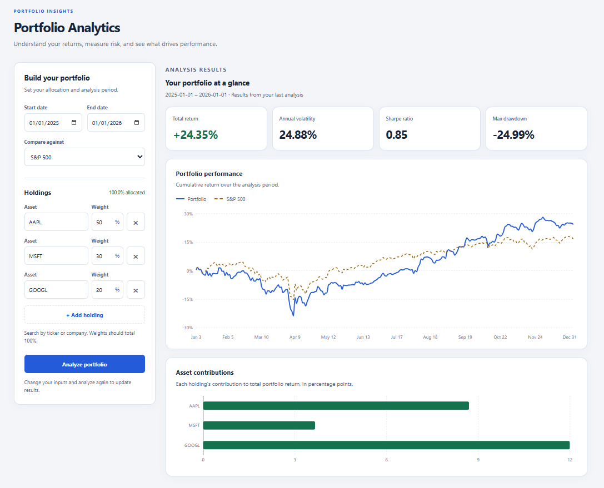

# Portfolio Analytics

## Purpose
A full-stack portfolio analytics dashboard for analyzing historical investment performance, risk, benchmark comparisons, and individual asset contributions.

Built with React, TypeScript, FastAPI, pandas, and yfinance.

**[View Live Demo](https://portfolio-analytics-lemon.vercel.app/)**



## Features

- Build a portfolio with multiple stock holdings and custom weight allocations
- Search for stocks by ticker or company name
- Analyze historical portfolio performance over a selected date range
- Compare performance against the S&P 500, NASDAQ-100, or Dow Jones
- Calculate total return, annualized volatility, Sharpe ratio, and maximum drawdown
- Visualize cumulative portfolio and benchmark performance
- Measure each holding's contribution to total portfolio return
- Validate portfolio allocations and analysis inputs
- Responsive dashboard interface

## Dependencies

**Frontend**
- React 19
- TypeScript
- Vite
- Recharts

**Backend**
- Python
- FastAPI
- Pydantic
- pandas
- yfinance

**Testing & Development**
- pytest
- FastAPI TestClient / httpx
- ESLint
- Git

## Application Architecture

The **Portfolio Analytics** application uses a separated frontend, API, and analytics-service architecture. The React frontend is responsible for user interaction and displaying portfolio results, while the FastAPI backend handles market data retrieval, validation, and portfolio calculations.

- **Frontend:** React and TypeScript application used to build the user interface and display portfolio analysis
    - **Components:** Reusable components for the portfolio form, holdings, stock search, portfolio metrics, and charts
    - **Hooks:** Contains reusable frontend logic such as stock searching.
    - **API:** Stores API requests used to communicate with the FastAPI backend.
    - **Types:** Stores shared TypeScript types used by the frontend.
- **Backend:** FastAPI appication responsible for processing portfolio analysis requests.
    - **Services:** Contains market data retrieval and portfolio calculation functions.
    - **Schemas:** Defines request and response models used by the API.
    - **Tests:** Contains unit and API tests for portfolio calculations, validation, and endpoints.
    - **Main:** Defines the FASTAPI application and API endpoints.

## Folder Stucture:
```
/backend
    /services           # Market data retrieval and portfolio calculations
    /tests              # Unit and API tests
    main.py             # FastAPI application and API endpoints
    schemas.py          # API request and response models

/docs
    /images             # images used in project documentation

/frontend          
    /src                
        /api            # Backend API requests
        /components     # Reusable UI and chart components
        /hooks          # Reusable React hooks
        App.tsx         # Main application component
        config.ts       # Frontend configuration
        types.ts        # Shared TypeScript types
```

## Running Locally

**Backend**
- Navigate to backend directory:

```bash
cd backend
```

- Create and active a Python virtual environment:

```bash
python -m venv .env
.\.env\Scripts\Activate.ps1
```

- Install the required dependencies:

```bash
pip install -r requirements.txt
```

- Start the FastAPI server:

```bash
uvicorn main:app --reload
```

The backend will run at **`http://127.0.0.1:8000`**

**Frontend**
- Navigate to frontend directory:

```bash
cd frontend
```

- Install the required dependencies:

```bash
npm install
```

- Start the development server:

```bash
npm run dev
```

The application will be available at **`http://localhost:5173`** and will connect to local FastAPI server at **`http://127.0.0.1:8000`**